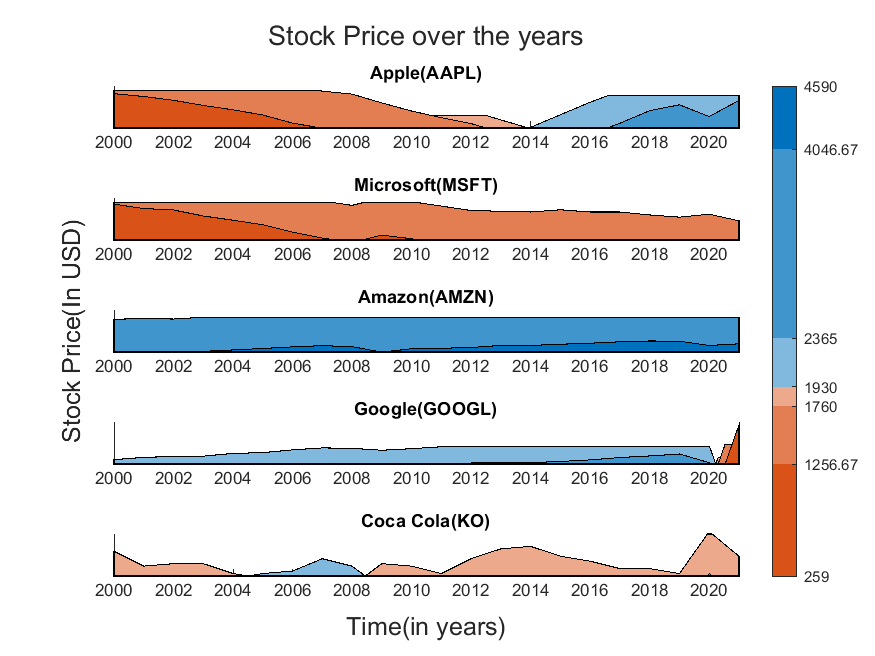

# Horizon Chart
Version 1.0


[](https://www.mathworks.com/matlabcentral/fileexchange/133607-horizon-chart)



## Description
The Horizon Chart is a data visualization technique that displays time-series data in a compact and layered format, improving readability and enabling comparison of multiple datasets over time.

## Dependencies
For optimal performance and accurate graphs, please install the <b> Mapping Toolbox </b>.

## Syntax
* horizonChart creates a Horizon Chart x-axis data and y-axis data for each slice
* `horizonChart(x, y)` creates a horizon chart with x an y data and NumBands = 2 i.e. in each of the slices, the data is divided into
  2 regions - one above the baseline and one below the baseline
* `horizonChart(x, y, numBands)` creates a horizon chart with x and y data with number of bands = numBands. Number of Bands is the number of
    sections that the data is divided into
* `horizonChart(__ , Name, Value)` specifies additional options for the horizon chart using one or more name-value pair arguments. Specify the options after all other input arguments.

## Name-Value Pair Arguments/Properties

* `XData` XData is a 2-D matrix where each column specifies the  x-coordinate of data to be displayed in an individual slice of the of the chart.  
  `XData` can also be a 1-D matrix which can denote the common x-values for each of the subcharts/ individual slices. 
* `YData` YData is a 2-D matrix where each column specifies the y-coordinate of data to be displayed in an individual slice of the chart.
* `Labels` A list of labels for each of the slices in the chart
* `NumBands` Number of Bands/Segments to divide the Horizon chart

## Stylistic Name-Value Pair Arguments/Properties

* `ColorAboveBaseline` It is used to determine color gradient that bands above the baseline are shaded with. 
* `ColorBelowBaseline` It is used to determine color gradient that bands below the baseline are shaded with
* `XLabel` Label for X-Axis
* `YLabel` Label for Y-Axis
* `Title` Title for the Horizon Chart

## How to use it 

```
n_stocks = 5;
[y_data, x_data, labels] = GenerateRandomData(n_stocks);

% Create a basic Horizon Chart with 5 Bands(Data is divided into 5 different segments)
basicHorizonChart = horizonChart(x_data, y_data, 5);


```